# SPSS-Consumer-Behavior-Analysis
Quantitative marketing research and consumer behavior analysis using IBM SPSS Statistics.
#  Consumer Behavior & Marketing Analytics for Natural Beauty Products

##  Executive Summary
This case study evaluates the impact of promotional advertising on consumer awareness, perception, and purchase intention towards natural and healthy cosmetics in Egypt. Using quantitative research methods and **IBM SPSS Statistics**, this project validates survey scales, performs demographic profiling, and executes hypothesis testing (Pearson Correlation, One-Way ANOVA, and Chi-Square) to translate statistical outputs into actionable marketing strategies.

---

##  Business Problem & Objectives
Cosmetics brands face increasing competition in the Egyptian FMCG market. Marketing managers need to determine whether promotional advertisements effectively build brand awareness and positive consumer perceptions, and how these factors directly drive final purchase intent.

**Key Objectives:**
- Evaluate scale reliability and measurement validity for consumer attitude, perception, awareness, and purchase intention.
- Analyze consumer demographics and purchasing habits across selected Egyptian governorates.
- Test statistical hypotheses regarding the relationships between advertising effectiveness and consumer purchase intention.
- Formulate data-driven marketing recommendations to target high-value customer segments.

---

##  Data & Methodology
- **Sample Size:** $N = 28$ quantitative survey responses.
- **Geographic Scope:** Egyptian governorates (Qena, Alexandria, Assiut, Cairo).
- **Analytical Tool:** IBM SPSS Statistics.
- **Statistical Procedures:**
  - **Reliability:** Cronbach’s Alpha.
  - **Descriptive Statistics:** Frequencies, Percentages, Means, and Histograms.
  - **Inferential Statistics:** Pearson Correlation, One-Way ANOVA, and Chi-Square Test of Independence.

---

##  Key Analytical Findings & Statistical Testing

### 1. Scale Reliability (Cronbach's Alpha)
To ensure data internal consistency and measurement accuracy, reliability tests were conducted across all constructs:
- **Attitude towards Ad:** $\alpha = 0.911$ (6 items)
- **Awareness:** $\alpha = 0.943$ (6 items)
- **Perception:** $\alpha = 0.902$ (3 items)
- **Purchase Intention:** $\alpha = 0.833$ (3 items)

  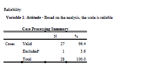
  

  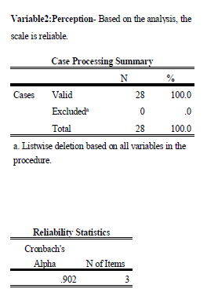
  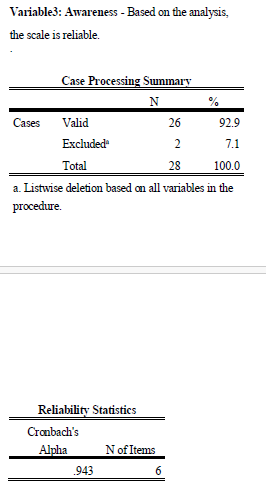

  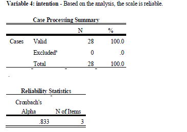

> **Conclusion:** All constructs exceeded the standard benchmark of $0.70$, confirming high internal reliability across survey items.

---

### 2. Demographic Profile
- **Gender:** **75.0% Female** ($n=21$) vs. **25.0% Male** ($n=7$).
- **Geography:** Qena (46.4%), Alexandria (21.4%), Assiut (17.9%), and Cairo (14.3%).
- **Education:** 57.1% held a College Degree.
- **Monthly Income:** 42.9% earned between 3,000 and <5,000 L.E.

### 3. Descriptive Statistics & Frequency Analysis
To analyze consumer response distributions and purchasing habits, frequency analyses and histograms were evaluated across key study variables:

  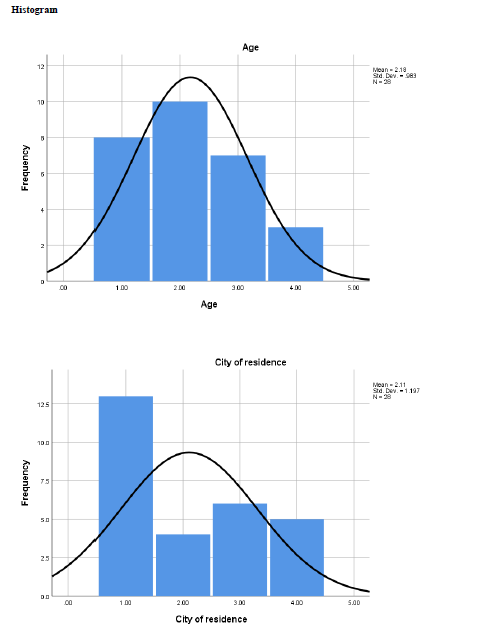
  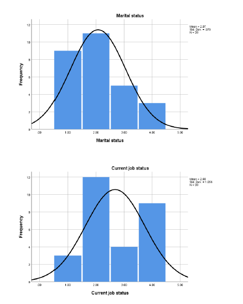

  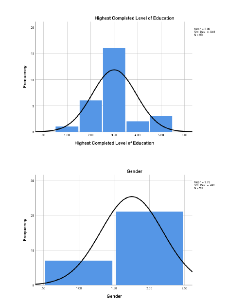
  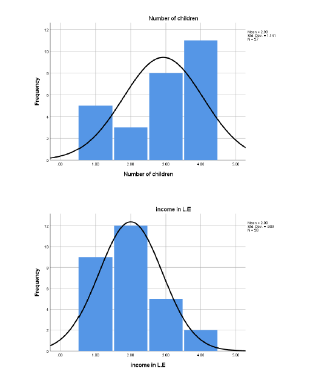

---

### 4. Hypothesis Testing (Inferential Statistics)

#### A. Pearson Correlation Analysis
- **H1 (Supported):** Strong positive correlation between **Attitude towards Ad** and **Awareness** ($r = 0.791, p < 0.001$).
- **H2 (Supported):** Strong positive correlation between **Attitude towards Ad** and **Perception** ($r = 0.783, p < 0.001$).
- **H3 (Supported):** Strong positive correlation between **Awareness** and **Purchase Intention** ($r = 0.775, p < 0.001$).
- **H4 (Supported):** Strong positive correlation between **Perception** and **Purchase Intention** ($r = 0.741, p < 0.001$).

  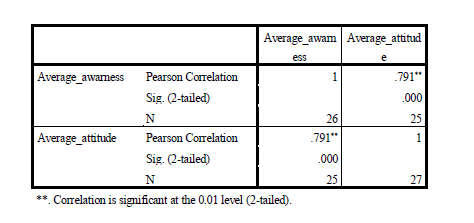
  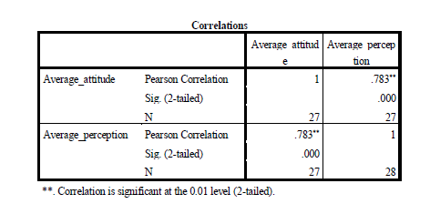

---

#### B. One-Way ANOVA (Education Level vs. Purchasing Behavior)
- Tested whether product preference, buying frequency, or retail channels vary significantly by education level.
- **Results:**
  - Most Purchased Product: $F = 1.419, p = 0.259$
  - Buying Frequency: $F = 1.453, p = 0.249$
  - Purchase Channel: $F = 0.139, p = 0.966$
- **Conclusion:** $p > 0.05$ across all variables, accepting $H_0$. Educational background does not significantly alter retail channel choices or purchasing frequency.

  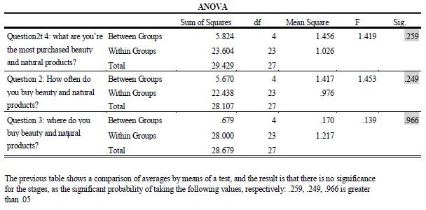

---

#### C. Chi-Square Test of Independence (Gender vs. Education Level)
- Tested the relationship between Gender and Highest Level of Education.
- **Result:** Pearson Chi-Square $\chi^2 = 13.222, df = 4, p = 0.010$.
- **Conclusion:** Since $p = 0.010 < 0.05$, $H_0$ is rejected, indicating a statistically significant association between gender and educational attainment in the sample group.

  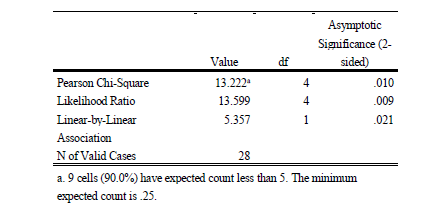

---

##  Business Recommendations
1. **Target Customer Persona:** Allocate **75% of promotional budgets** toward female consumers aged 18–30.
2. **Ad Content Strategy:** Prioritize informational and emotional ad creatives highlighting health benefits and natural ingredients; advertising is the primary driver of awareness ($r = 0.791$) and perception ($r = 0.783$).
3. **Omnichannel Retail:** Maintain unified distribution across pharmacies and digital storefronts, as retail channel preferences do not vary significantly by education level.
